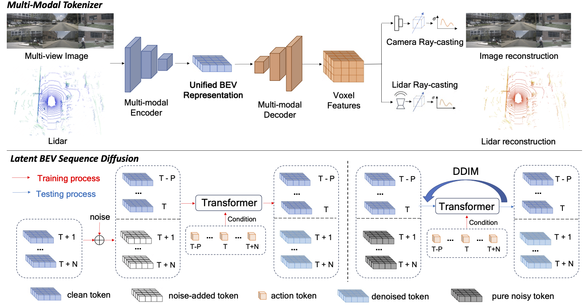
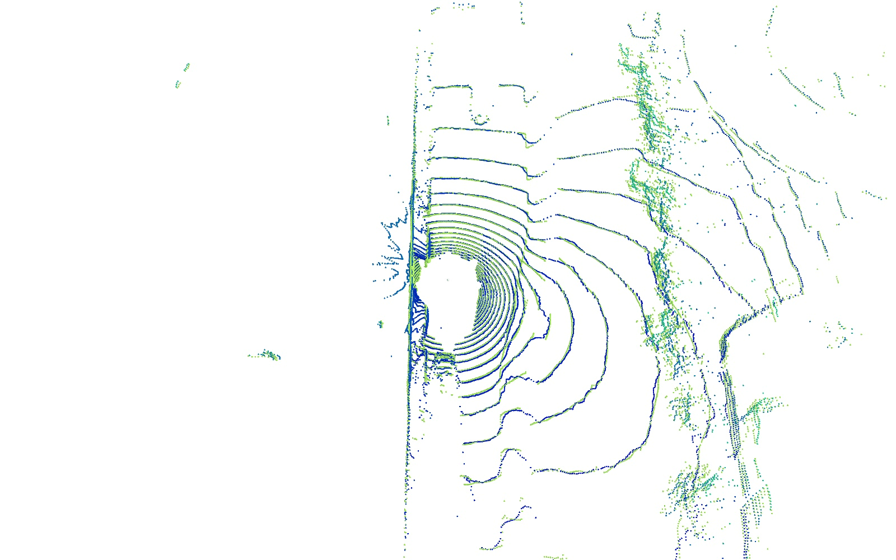
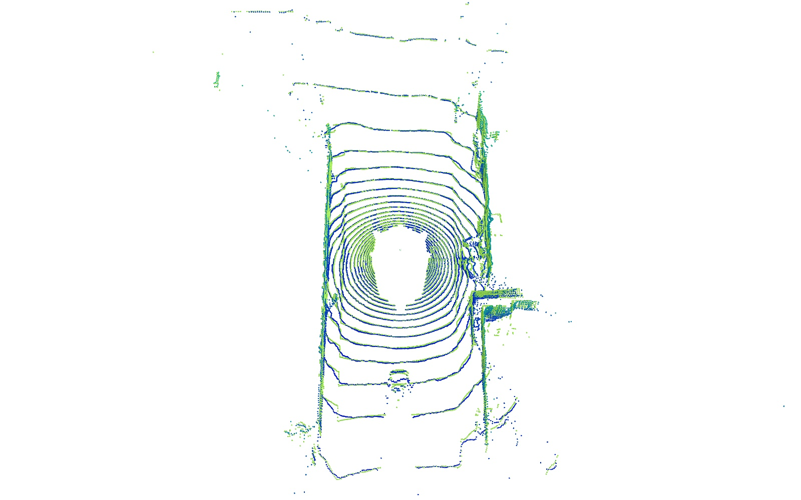

# BEVWorld: A Multimodal World Model for Autonomous Driving via Unified BEV Latent Space


> Yumeng Zhang, Shi Gong, Kaixin Xiong, Xiaoqing Ye&#8224;, Xiao Tan, Fan Wang, Jizhou Huang&#8224;, Hua Wu, Haifeng Wang
>
> Baidu Inc.
>
> <sup>&#8224;</sup> Corresponding author

## Overview


World models are receiving increasing attention in autonomous driving for their ability to predict potential future scenarios. In this paper, we present BEVWorld, a novel approach that tokenizes multimodal sensor inputs into a unified and compact Bird's Eye View (BEV) latent space for environment modeling. The world model consists of two parts: the multi-modal tokenizer and the latent BEV sequence diffusion model. The multi-modal tokenizer first encodes multi-modality information and the decoder is able to reconstruct the latent BEV tokens into LiDAR and image observations by ray-casting rendering in a self-supervised manner. Then the latent BEV sequence diffusion model predicts future scenarios given action tokens as conditions. Experiments demonstrate the effectiveness of BEVWorld in autonomous driving tasks, showcasing its capability in generating future scenes and benefiting downstream tasks such as perception and motion prediction.


## Demo

### Scene 1



### Scene 2



## Contact
If you have any questions or suggestions about this repo, please feel free to contact us {zhangyumeng04,gongshi,yexiaoqing,huangjizhou01}@baidu.com


## Citation

If you find this project helpful, please consider citing the following paper:
```
@article{zhang2024bevworld,
      title={BEVWorld: A Multimodal World Model for Autonomous Driving via Unified BEV Latent Space}, 
      author={Yumeng, Zhang and Shi, Gong and Kaixin, Xiong and Xiaoqing, Ye and Xiao, Tan and Fan, Wang and Jizhou, Huang and Hua, Wu and Haifeng, Wang},
      journal={arXiv preprint arXiv:2407.05679},
      year={2024},
}
```
